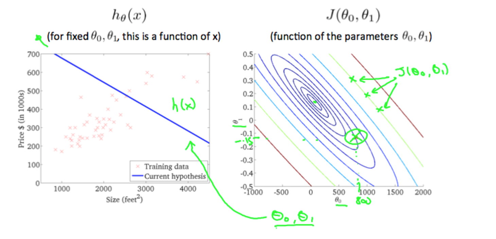

* [Week 1](#week-1)
  - [Supervised Learning vs Unsupervised learning](#supervised-learning-vs-unsupervised-learning)
  - Model Representation
  - Cost function
  - Gradient descent

****
# Week 1

## Supervised Learning vs Unsupervised learning
| Supervised Learning | Unsupervised Learning|
|-------------------- | -------------------- |
| we given dataset and already know what our output look likes.| we don't know what our output look like|
|  categorized into "regression" and "classification" problems | derive this structure by clustering the data based on relationships among the variables in the data |
| We can check our prediction results|there is no feedback based on the prediction results|
| Example: spam/non-spam email, diabetes/not,  | Example: group news, group market size, ...|

## Model Representation
- `m`: dataset to training machine.
- `x`: input of dataset. x(i), i is index of x record.
- `y`: output of dataset
- h(x): hypothesis function that we got from training the dataset.

## Cost Function
- A contour plot is a graph that contains many contour lines.

